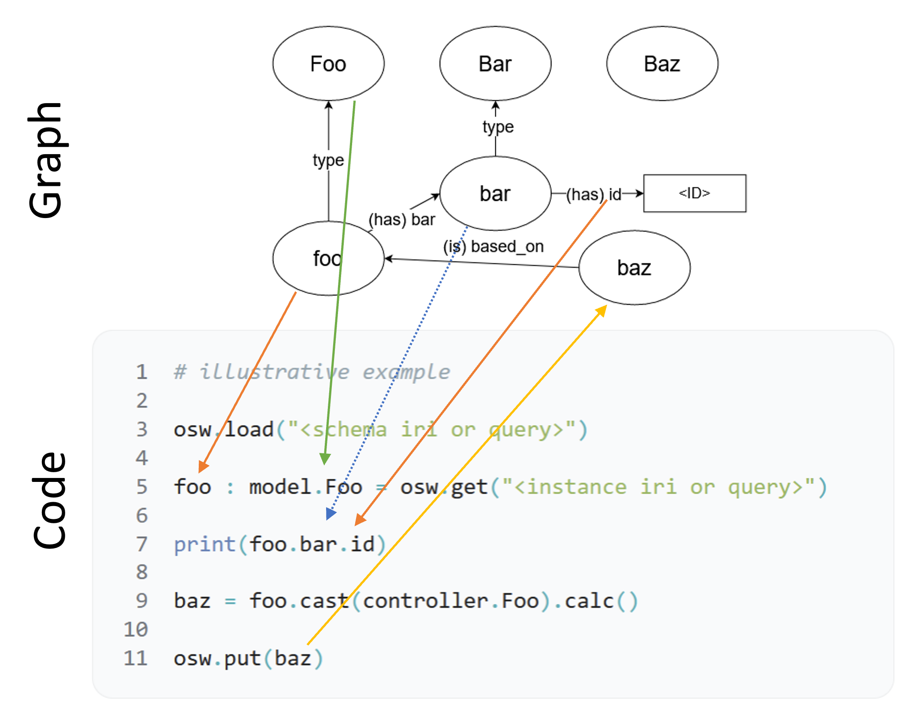

<p align="center">
  
</p>

[](https://zenodo.org/doi/10.5281/zenodo.8374237)
[](https://pypi.org/project/oold/)
[](https://github.com/OO-LD/oold-python/actions/workflows/main.yml?query=branch%3Amain)
[](https://codecov.io/gh/OO-LD/oold-python)
[](https://github.com/OO-LD/oold-python/blob/main/LICENSE)


# oold-python

Linked data class python package for object oriented linked data ([OO-LD](https://github.com/OO-LD/schema)) based on [pydantic](https://github.com/pydantic/pydantic). This package aims to implement this functionality independent from the [osw-python](https://github.com/OpenSemanticLab/osw-python) package - work in progress.

## Installation

With [uv](https://docs.astral.sh/uv/) (recommended):

```bash
uv add oold
```

Or with pip:

```bash
pip install oold
```

## Objectives
- lossless transpilation between [OO-LD](https://github.com/OO-LD/schema) schemas and extended pydantic data classes
- interpret string IRIs with `oold-range` annotation as typed class property
- dynamically resolve such IRIs from one or multiple backends (simple in-memory dict, RDF-Graph, SPARQL-Endpoint, Document Store, etc.)
- serialize class instances to JSON-LD while replacing python object-references with IRIs
- apply filters / queries to backend-requests (SPARQL, GraphQL, ...)

## Related Work

| Library | Notes |
|---|---|
| [RDFLib](https://github.com/RDFLib/rdflib) | RDF management; no schema validation or type safety. Used as a backend by oold-python. |
| [SuRF](https://github.com/cosminbasca/surfrdf) | ORM-like RDF; dynamically generated classes, no static type checking. |
| [Owlready2](https://github.com/pwin/owlready2) | OWL-aligned classes with native reasoning; no remote SPARQL support. |
| [twa](https://github.com/TheWorldAvatar/baselib/tree/main/python_wrapper) | Pydantic-based OGM; tightly couples RDF properties and type annotations. |
| [COLD](https://github.com/DigiBatt/cold/) | Generates static classes from OWL; no object-to-graph mapping. |

See also: Bai et al. [https://doi.org/10.1039/D5DD00069F](https://doi.org/10.1039/D5DD00069F)


## Features

### Code Generation
Generate Python data models from OO-LD Schemas (based on [datamodel-code-generator](https://github.com/koxudaxi/datamodel-code-generator)):

```python
from oold.generator import Generator
import importlib
import datamodel_code_generator
import oold.model.model as model

schemas = [
    {   # minimal example
        "id": "Foo",
        "title": "Foo",
        "type": "object",
        "properties": {
            "id": {"type": "string"},
        },
    },
]
g = Generator()
g.generate(schemas, main_schema="Foo.json", output_model_type=datamodel_code_generator.DataModelType.PydanticBaseModel)
importlib.reload(model)

# Now you can work with your generated model
f = model.Foo(id="ex:f")
print(f)
```

This example uses the built-in `Generator` to create a basic Pydantic model (v1 or v2) from JSON schemas.

More details see [example code](./tests/test_oold.py)

### Object Graph Mapping



 > Illustrative example how the object orient linked data (OO-LD) package provides an abstract knowledge graph (KG) interface. First (line 3) primary schemas (Foo) and their dependencies (Bar, Baz) are loaded from the KG and transformed into python dataclasses. Instantiation of foo is handled by loading the respective JSON(-LD) document from the KG and utilizing the type relation to the corresponding schema and dataclass (line 5). Because bar is not a dependent subobject of foo it is loaded on-demand on first access of the corresponding class attribute of foo (foo.bar in line 7), while id as dependent literal is loaded immediately in the same operation. In line 9 baz is constructed by an existing controller class subclassing Foo and finally stored as a new entity in the KG in line 11.

Represent your domain objects easily and reference them via IRIs or direct object instances. For instance, if you have a `Foo` model referencing a `Bar` model:

```python
import oold.model.model as model

# Create a Foo object linked to Bar
f = model.Foo(
    id="ex:f",
    literal="test1",
    b=model.Bar(id="ex:b", prop1="test2"),
    b2=[model.Bar(id="ex:b1", prop1="test3"), model.Bar(id="ex:b2", prop1="test4")],
)

print(f.b.id)          # ex:b
print(f.b2[0].prop1)   # test3
```

You can also refer to objects by IRI:

```python
# Assign IRI strings directly
f = model.Foo(
    id="ex:f",
    literal="test1",
    b="ex:b",  # automatically resolved to a Bar object
    b2=["ex:b1", "ex:b2"],
)
```

Thanks to the resolver mechanism, these IRIs turn into fully-fledged objects as soon as you need them.

More details see [example code](./tests/test_oold.py)

### RDF-Export
Easily convert your objects to RDF (JSON-LD) and integrate with SPARQL queries:

```python
from rdflib import Graph
from typing import List, Optional

# Example: Convert Person objects to RDF
p1 = model.Person(name="Alice")
p2 = model.Person(name="Bob", knows=[p1])

# Export to JSON-LD
print(p2.to_jsonld())

# Load into RDFlib
g = Graph()
g.parse(data=p1.to_jsonld(), format="json-ld")
g.parse(data=p2.to_jsonld(), format="json-ld")

# Perform SPARQL queries
qres = g.query("""
    SELECT ?name
    WHERE {
        ?s <https://schema.org/knows> ?o .
        ?o <https://schema.org/name> ?name .
    }
""")
for row in qres:
    print("Bob knows", row.name)
```

The extended dataclass notation includes semantic annotations as JSON-LD context, giving you powerful tooling for knowledge graphs, semantic queries, and data interoperability.

More details see [example code](./tests/test_rdf.py)

### BaseController

Base mixin for controllers that extend `LinkedBaseModel` data classes. Controllers add runtime behavior (connections, archiving, state) without polluting the data model.

```python
from oold.model import BaseController, LinkedBaseModel

class Robot(LinkedBaseModel):
    name: str
    joint_count: int = 6
    connection_url: str = ""

class RobotController(BaseController, Robot):
    _connected: bool = False

    def connect(self):
        self._connected = True
        print(f"Connected to {self.connection_url}")

    def move(self, joint: int, angle: float):
        if not self._connected:
            raise RuntimeError("Not connected")
        print(f"Moving joint {joint} to {angle} deg")

ctrl = RobotController(name="arm-1", connection_url="tcp://192.168.1.10:5000")
ctrl.connect()
ctrl.move(1, 45.0)

# Serialization includes model fields, strips controller state
ctrl.to_json()  # {"name": "arm-1", "joint_count": 6, "connection_url": "tcp://..."}
```

Key features:
- **Auto-detects the pure data model** from MRO - no manual configuration needed
- **Serialization strips controller fields** - `to_json()` / `to_jsonld()` only include data model fields
- **Type registry exclusion** - controllers don't replace their data model in the `_types` lookup, so backend resolution always returns the pure model class
- **Multi-model support** - `Controller(ModelA, ModelB)` merges type arrays from both models

### cast()

Convert between model classes, preserving `__iris__` references:

```python
target = source.cast(TargetClass, remove_extra=True, none_to_default=True)

# Or construct directly from another model instance:
target = TargetClass(source, extra_field="value")
```

Parameters:
- `none_to_default` - drop None/empty list attributes so the target uses its defaults
- `remove_extra` - drop fields not defined on the target class
- `silent` - suppress warnings about dropped fields (default: True)

### Backends

Built-in backends for entity persistence and resolution:

| Backend | Storage | Query support |
|---------|---------|---------------|
| **SimpleDictDocumentStore** | In-memory dict, optional JSON file (`file_path`) | Filter by field |
| **SqliteDocumentStore** | SQLite database (default `format=JSON`) | - |
| **LocalSparqlBackend** | In-memory RDF graph (rdflib) | SPARQL |

```python
from oold.backend.document_store import SimpleDictDocumentStore
from oold.backend.interface import StoreParam, SetResolverParam, set_resolver

store = SimpleDictDocumentStore(file_path="./entities.json")
set_resolver(SetResolverParam(iri="ex", resolver=store))

# Store and resolve entities
store.store(StoreParam(nodes={"ex:foo": foo}))
loaded = MyModel["ex:foo"]  # resolves via registered backend
```

Custom backends implement the `Backend` interface (`resolve_iris`, `store_json_dicts`).

## Development

This project uses [uv](https://docs.astral.sh/uv/) and `make`. Clone and set up:

```bash
git clone https://github.com/OO-LD/oold-python
cd oold-python
make install   # create the venv and install pre-commit hooks
```

Common tasks:

```bash
make check     # ruff (lint+format), ty (types), deptry (deps)
make test      # run the test suite with coverage
make docs      # build and serve the documentation locally
```

See [docs/contributing.md](docs/contributing.md) for the full workflow.

### Benchmarking

```bash
uv run tox -e benchmark           # run benchmarks
uv run tox -e benchmark-compare   # compare against the previous run without storing results
```

### Contributing

We welcome contributions! Fork the repository, enable the pre-commit hooks, and open a pull request:

```bash
pre-commit install
```

Please also enable GitHub Actions on your fork so the test suite runs automatically.

## Citation

If you use oold-python in your research, please cite it:

```bibtex
@software{oold_python,
  author  = {OO-LD Contributors},
  title   = {oold-python: Object Oriented Linked Data for Python},
  url     = {https://github.com/OO-LD/oold-python},
  doi     = {10.5281/zenodo.8374237},
}
```
