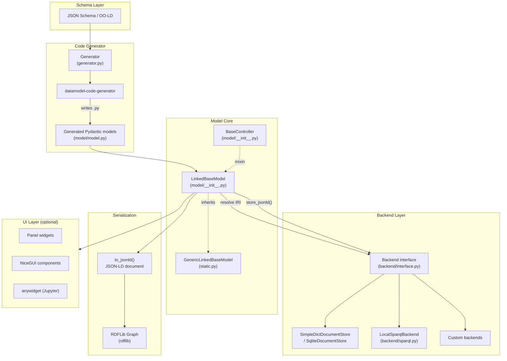
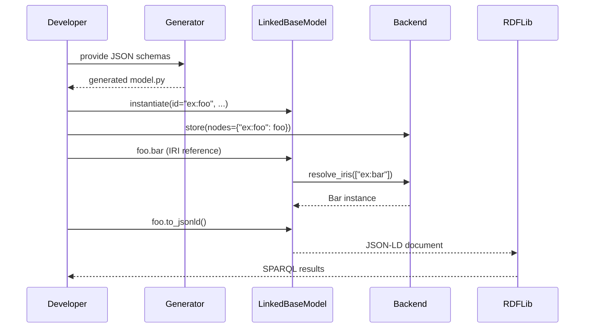

# Architecture

oold-python is organized into four cooperating layers: the **model core**, the **code generator**, the **backend system**, and an optional **UI layer**. This page explains how they fit together.

---

## Component overview

---

## Layer descriptions

### Schema Layer

OO-LD schemas are standard JSON Schema documents extended with a `range` keyword that marks string fields as IRI references to other schemas. Schemas can compose via `allOf` and reference each other via `$ref`.

### Code Generator (`generator.py`)

`Generator.generate()` accepts a list of schema dicts and writes a `.py` file containing Pydantic classes. It delegates to [`datamodel-code-generator`](https://github.com/koxudaxi/datamodel-code-generator) for the actual Python source generation, then post-processes the output to wire up oold-python's IRI-resolution machinery.

### Model Core

**`GenericLinkedBaseModel`** (`static.py`) is the base class. It adds:

- JSON-LD context injection via `json_schema_extra`
- `to_jsonld()` / `to_json()` serialization that replaces Python object references with IRIs
- A `_types` registry mapping IRI type strings to Python classes

**`LinkedBaseModel`** (`model/__init__.py`) extends the generic base with:

- IRI-transparent field validation: fields annotated with `range` accept both objects and IRI strings
- Lazy resolution via `__get__` descriptors — IRIs are resolved on first attribute access
- Class-level `[]` subscript operator for direct IRI lookup
- `cast()` for cross-model conversion

**`BaseController`** is a mixin for adding runtime state. See [BaseController](how-to/controller.md).

### Backend Layer

All backends implement the `Backend` interface from `backend/interface.py`:

| Backend | Storage | SPARQL |
|---|---|---|
| `SimpleDictDocumentStore` | In-memory dict, optional JSON file | No |
| `SqliteDocumentStore` | SQLite database | No |
| `LocalSparqlBackend` | In-memory RDFLib graph | Yes |

Backends are registered per IRI prefix via `set_resolver` / `set_backend`, so multiple backends can coexist in one application.

### Serialization

`to_jsonld()` produces a self-describing JSON-LD document. Object references are serialized as IRI strings, not as embedded objects — keeping the graph flat and enabling partial loading. The output can be fed directly into RDFLib or any JSON-LD aware triple store.

### UI Layer (optional)

`oold.ui` contains optional integrations for [Panel](https://panel.holoviz.org/), [NiceGUI](https://nicegui.io/), and [Jupyter anywidget](https://anywidget.dev/). These are not installed by default.

---

## Data flow

1. **Schema → model**: `Generator` converts JSON schemas into typed Pydantic classes
2. **Instantiation**: models are created like any Pydantic class; IRI-valued fields are stored as strings
3. **Persistence**: `store()` serializes instances and writes to the backend
4. **Resolution**: accessing an IRI-valued attribute triggers a backend lookup; the result is cached on the instance
5. **Serialization**: `to_jsonld()` replaces all resolved objects with their IRIs, producing a flat JSON-LD graph

---

## Key design decisions

**IRI transparency** — the same field can hold either an object or an IRI. This means you can work with partial graphs (load only what you need) and still produce correct JSON-LD.

**Schema-first** — all semantic meaning lives in the JSON schema, not in Python class annotations. This makes schemas portable across languages and tools.

**Pluggable backends** — no single storage technology is assumed. Swapping backends requires only re-registering the prefix; model code is unchanged.

**Controller separation** — runtime behavior is kept out of data models entirely, so serialization is always deterministic and backend-independent.
