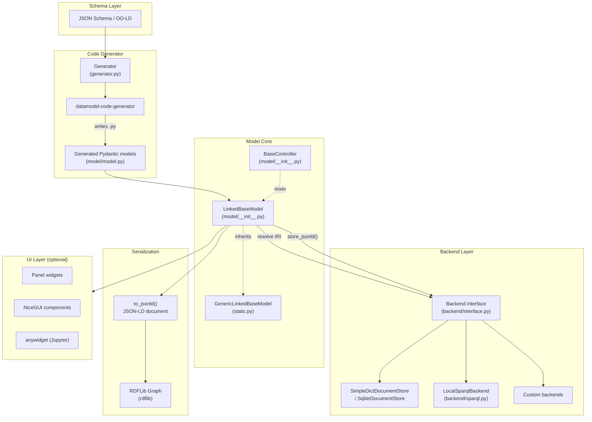
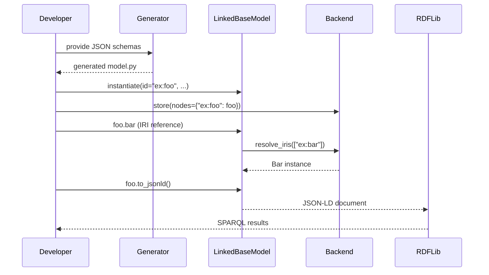

# Architecture

oold-python is organized into four cooperating layers: the **model core**, the **code generator**, the **backend system**, and an optional **UI layer**. This page explains how they fit together.

---

## Component overview

```mermaid
graph TD
    subgraph Schema["Schema Layer"]
        JS["JSON Schema / OO-LD"]
    end

    subgraph Gen["Code Generator"]
        G["Generator\n(generator.py)"]
        DCG["datamodel-code-generator"]
        G --> DCG
        JS --> G
        DCG -->|"writes .py"| PM["Generated Pydantic models\n(model/model.py)"]
    end

    subgraph Core["Model Core"]
        GLBM["GenericLinkedBaseModel\n(static.py)"]
        LBM["LinkedBaseModel\n(model/__init__.py)"]
        BC["BaseController\n(model/__init__.py)"]
        PM --> LBM
        LBM -.->|inherits| GLBM
        BC -.->|mixin| LBM
    end

    subgraph Backends["Backend Layer"]
        BI["Backend interface\n(backend/interface.py)"]
        DS["SimpleDictDocumentStore\n/ SqliteDocumentStore"]
        SP["LocalSparqlBackend\n(backend/sparql.py)"]
        EXT["Custom backends"]
        BI --> DS
        BI --> SP
        BI --> EXT
    end

    subgraph Serialization["Serialization"]
        JSONLD["to_jsonld()\nJSON-LD document"]
        RDFLIB["RDFLib Graph\n(rdflib)"]
        JSONLD --> RDFLIB
    end

    subgraph UI["UI Layer (optional)"]
        PANEL["Panel widgets"]
        NICEGUI["NiceGUI components"]
        WIDGET["anywidget (Jupyter)"]
    end

    LBM -->|"resolve IRI"| BI
    LBM -->|"store_jsonld()"| BI
    LBM --> JSONLD
    LBM --> UI
```

---

## Layer descriptions

### Schema Layer

OO-LD schemas are standard JSON Schema documents extended with a `range` keyword that marks string fields as IRI references to other schemas. Schemas can compose via `allOf` and reference each other via `$ref`.

### Code Generator (`generator.py`)

`Generator.generate()` accepts a list of schema dicts and writes a `.py` file containing Pydantic classes. It delegates to [`datamodel-code-generator`](https://github.com/koxudaxi/datamodel-code-generator) for the actual Python source generation, then post-processes the output to wire up oold-python's IRI-resolution machinery.

### Model Core

**`GenericLinkedBaseModel`** (`static.py`) is the base class. It adds:

- JSON-LD context injection via `json_schema_extra`
- `to_jsonld()` / `to_json()` serialization that replaces Python object references with IRIs
- A `_types` registry mapping IRI type strings to Python classes

**`LinkedBaseModel`** (`model/__init__.py`) extends the generic base with:

- IRI-transparent field validation: fields annotated with `range` accept both objects and IRI strings
- Lazy resolution via `__get__` descriptors - IRIs are resolved on first attribute access
- Class-level `[]` subscript operator for direct IRI lookup
- `cast()` for cross-model conversion

**`BaseController`** is a mixin for adding runtime state. See [BaseController](how-to/controller.md).

### Backend Layer

All backends implement the `Backend` interface from `backend/interface.py`:

| Backend | Storage | SPARQL |
|---|---|---|
| `SimpleDictDocumentStore` | In-memory dict, optional JSON file | No |
| `SqliteDocumentStore` | SQLite database | No |
| `LocalSparqlBackend` | In-memory RDFLib graph | Yes |

Backends are registered per IRI prefix via `set_resolver` / `set_backend`, so multiple backends can coexist in one application.

### Serialization

`to_jsonld()` produces a self-describing JSON-LD document. Object references are serialized as IRI strings, not as embedded objects - keeping the graph flat and enabling partial loading. The output can be fed directly into RDFLib or any JSON-LD aware triple store.

### UI Layer (optional)

`oold.ui` contains optional integrations for [Panel](https://panel.holoviz.org/), [NiceGUI](https://nicegui.io/), and [Jupyter anywidget](https://anywidget.dev/). These are not installed by default.

### Validation Layer (optional)

`oold.validation` checks that a schema is well formed and that its `@context` actually carries
every declared property into RDF. It is a native port of the reference harness in
[oold-schema](https://github.com/OO-LD/oold-schema)'s
[`scripts/validate.mjs`](https://github.com/OO-LD/oold-schema/blob/v1.0.0-rc.2/scripts/validate.mjs)
(pinned at `v1.0.0-rc.2`, since upstream intends to replace that script with this implementation),
and reuses `pyld` from the serialization layer, so the JSON-LD half of it adds no dependencies.

One pipeline backs three surfaces - the library API, the `oold validate` CLI, and an MCP server -
so there is a single implementation to keep correct. The meta-schemas it validates against are
versioned: a hand-curated history ships in the package, and a schema can be checked against
several versions in one run. See [Validation](how-to/validation.md).

---

## Validation subsystem design

The validator is organized around two identifier systems that are not peers.

**Rule ids** (`OOLD-RT-002`) name *which specification requirement was violated*. They are owned
by the OO-LD specification, are permanent, and come from the versioned rule catalogue
(`oold-rules.json`) vendored per meta-schema version (see
[Maintaining the vendored meta-schemas and fixtures](maintaining-meta-schemas.md)). This is what
belongs in a review comment or a changelog.

**Check ids** (`lint.container`) name *which check found it*. They are owned by this repository
and follow the implementation, and they appear in reports, CI logs and, before long, in
suppression comments - check ids are a public interface. Renaming one silently breaks whatever
depended on it, and unlike rule ids there is no automated guard, so a rename is a breaking change:
say so in the commit, and prefer adding a new id over repurposing an existing one.

Some checks enforce no rule and never will - a schema is well-formed only if it validates against
the meta-schema, some checks are the validator's own methodology (round-tripping, variant
generation) rather than something the specification mandates, and some are self-tests about the
fixture suite. Minting a rule id for these would push one tool's implementation strategy into the
specification. Rule ids are also not always available: validating against a meta-schema version
that ships no rule catalogue produces a finding with a check id and no rule id at all, which is
why the check id, not the rule id, is the identifier that survives every specification version.

### Severity is read from the catalogue, never hardcoded

A check reports a problem; whether that is a failure or a warning comes from the rule's `level`
in the vendored catalogue, never from a hardcoded column in the check itself. This is what lets
one code base validate against several specification versions at once: relaxing a `MUST` to a
`SHOULD` upstream turns a failure into a warning here with no code change.

A rule absent from the selected version's catalogue, or marked deprecated there, is skipped with
a message saying so, rather than checked anyway - older meta-schema versions ship no catalogue at
all and skip the whole `rule.*` family. A false positive costs far more than a missed finding,
because it teaches people to ignore the output, so when a rule is only partly decidable, a check
verifies the part it is sure of and leaves the rest alone.

Checks are judged against the **resolved** context, not a schema's literal `@context`.
`ContextView` is what term definitions mean after remote contexts and prefixes are applied - OO-LD
contexts inherit, so reading `schema["@context"]` directly would report violations against schemas
that are entirely correct.

### One registry, not several hand-synced tables

`CHECKS`, a tuple of `CheckInfo` records in `check_registry.py`, is the single source of truth for
every check the validator can run: its id, a one-line summary, the rule it enforces (if any), and
how to detect it. A finding always names the check that produced it, which raises two questions
only a registry answers well: where is the code that decided this, and what checks exist at all.
The first is answered by deriving the reported location from the detecting function itself with
`inspect`, rather than maintaining a hand-typed path that can drift the moment the function moves;
the second is answered by `oold checks list`, which has a single structure to read instead of
several tables that would otherwise need to be kept in step by hand.

### Why it does not drift

Tests hold the registry to what the validator actually does, run against the fixture corpus
rather than against the registry's own claims: every check id the suite emits must be registered;
every registered id must be emitted by the suite at least once, which catches a stale entry and a
check that silently stopped running; every rule a check names must exist in some vendored
catalogue, which catches a typo or a retired rule id; and, under a meta-schema version with no
catalogue, exactly the checks marked as predating the catalogue must run, which pins the
backward-compatibility promise to a test rather than to reviewer memory.

### The two repositories are decoupled on purpose

oold-schema and this package release on separate schedules, so neither pipeline waits on the
other. `coverage.rules` **warns** when a checkable rule has no check, rather than failing, because
a specification that has moved ahead must not break this build - a rule id absent from an older
catalogue is otherwise indistinguishable from a typo, and failing on it would break validation
against older meta-schema versions for no reason. Adding a check for a rule is described in
[Translating a specification rule](contributing.md#translating-a-specification-rule); do not add
a check for a rule that is not in any vendored catalogue, vendor the meta-schema version first.

### Pydantic at the boundaries, dataclasses inside

Two shapes of data live in this package, and each gets a different tool.

Pydantic `BaseModel` is used at the **boundaries**: data parsed from outside this process, and
data handed to a caller outside it. `Rule` (`meta_store.py`) parses one entry of the vendored rule
catalogue - untrusted in the sense that it comes from a JSON file generated by another
repository's toolchain, and a field it silently drops (`level`, above all - see
[Severity is read from the catalogue, never hardcoded](#severity-is-read-from-the-catalogue-never-hardcoded))
must fail loudly rather than let a `MUST` quietly validate as a `SHOULD`. `MetaBundle`, which
carries that catalogue alongside the meta-schemas, is pydantic for the same reason: it is
constructed from files this package does not own. The MCP server's tool results are pydantic for
the mirror-image reason - they are handed to a caller outside this process, and the whole point of
typing them is that an MCP client gets a real result schema to validate against, not an opaque
`dict[str, Any]`.

Plain `@dataclass` is used for internal value objects: data this package both produces and
consumes, never parsed from untrusted input. `CheckInfo` (`check_registry.py`) is the clearest
example - each entry is written once, by hand, in `CHECKS`, a tuple declared in this package's own
source. There is no file to fail to parse and no caller to hand a schema to; the only consumer is
this package's own code, at import time. Reaching for pydantic there would buy validation against
a shape that can only ever be correct, at the cost of a heavier import and a class that carries
callables (`detects`, `run`, `run_resolved`) pydantic has no reason to understand better than plain
Python already does.

---

## Data flow

```mermaid
sequenceDiagram
    participant Dev as Developer
    participant Gen as Generator
    participant Model as LinkedBaseModel
    participant Backend as Backend
    participant RDF as RDFLib

    Dev->>Gen: provide JSON schemas
    Gen-->>Dev: generated model.py

    Dev->>Model: instantiate(id="ex:foo", ...)
    Dev->>Backend: store(nodes={"ex:foo": foo})

    Dev->>Model: foo.bar  (IRI reference)
    Model->>Backend: resolve_iris(["ex:bar"])
    Backend-->>Model: Bar instance

    Dev->>Model: foo.to_jsonld()
    Model-->>RDF: JSON-LD document
    RDF-->>Dev: SPARQL results
```

1. **Schema → model**: `Generator` converts JSON schemas into typed Pydantic classes
2. **Instantiation**: models are created like any Pydantic class; IRI-valued fields are stored as strings
3. **Persistence**: `store()` serializes instances and writes to the backend
4. **Resolution**: accessing an IRI-valued attribute triggers a backend lookup; the result is cached on the instance
5. **Serialization**: `to_jsonld()` replaces all resolved objects with their IRIs, producing a flat JSON-LD graph

---

## Key design decisions

**IRI transparency** - the same field can hold either an object or an IRI. This means you can work with partial graphs (load only what you need) and still produce correct JSON-LD.

**Schema-first** - all semantic meaning lives in the JSON schema, not in Python class annotations. This makes schemas portable across languages and tools.

**Pluggable backends** - no single storage technology is assumed. Swapping backends requires only re-registering the prefix; model code is unchanged.

**Controller separation** - runtime behavior is kept out of data models entirely, so serialization is always deterministic and backend-independent.
